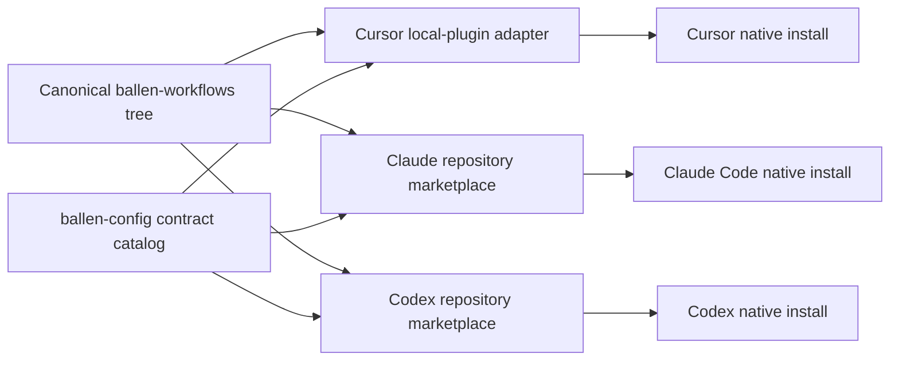

# Plato Reusable Skills Personal Plugin Detailed Design

## Status

Detailed design for review.

This document defines Workstream 2 of the
[Plato generic assets migration program](2026-07-27-plato-generic-assets-migration-design.md).
It supersedes the exploratory personal-workflow plugin notes. The product
direction and names recorded here are approved; implementation remains gated
on a separate executable plan and the native-behavior proofs identified below.

## Context

Plato contains several reusable engineering workflow skills, while
`ballen-config` already owns portable engineering standards and a standalone
`jujutsu-workflow` skill promoted from Plato. Delivering every reusable skill
as an independent managed tree would work mechanically, but it would obscure
their common ownership, repeat native metadata, and make cross-skill contracts
harder to validate.

The selected direction is one personal plugin named `ballen-workflows`. It
contains only distinct, portable workflow guidance. Native or third-party
plugins, connectors, and command-line tools remain authoritative for
operational capabilities. The existing standards library remains
authoritative for normative engineering guidance.

The first release contains:

| Skill | Origin | Treatment |
|---|---|---|
| `discover-project-standards` | Plato | Genericize and promote |
| `review-project-standards` | Plato | Genericize with a hard discovery dependency |
| `using-gitlab` | Plato | Rewrite for portability and explicit mutation safety |
| `using-jujutsu` | Promoted standalone skill | Rename and migrate into plugin ownership |
| `using-uv` | New | Create as a procedural companion to the standards library |

`using-github` follows as a separate mirror of `using-gitlab`. Broader review
orchestration, including `conduct-self-review`, remains on the roadmap until
its review primitives exist.

## Goals

- Maintain one authored plugin and skill tree in `ballen-config`.
- Install that plugin natively for Cursor, Claude Code, and Codex.
- Make the plugin a required default-profile component for all three
  harnesses, subject only to the existing whole-harness skip.
- Preserve native plugins and connectors as authoritative capability
  providers.
- Represent skill exports, capabilities, dependencies, workflow authority,
  and reviewed overlap dispositions explicitly in repository-owned metadata.
- Make plan, apply, update, doctor, skip, collision, and drift behavior
  deterministic and testable.
- Migrate the existing standalone `jujutsu-workflow` without deleting
  unmanaged or modified content.
- Preserve source provenance and a clear roadmap for later generic skills.

## Non-Goals

- Copy Plato's complete skill tree.
- Copy or migrate authentication, credentials, trust, sessions, memories,
  permissions, project paths, MCP state, caches, indexes, worktrees, receipts,
  or generated plugin state.
- Reimplement GitHub, GitLab, or other remote-service connectors.
- Make GitHub and GitLab workflows artificially identical.
- Move normative dependency, testing, typing, documentation, or
  source-control policy out of `assistants/shared/standards/`.
- Make one harness read another harness's installed files.
- Treat native plugin caches as source or authoritative inspection data.
- Clean up, rewrite, or backport changes to Plato.
- Add merge-request review, response, or review-learning workflows to the
  first release.
- Add `conduct-self-review` before its quality, test, type, change-scope, and
  authority contracts exist.
- Publish the plugin to a universal public marketplace in the first release.

## Design Invariants

1. `ballen-config` owns the genericized plugin after promotion.
2. The repository contains one common skill tree and three independently valid
   native manifests.
3. The plugin installs as one unit; the first release has no per-skill profile
   selector.
4. Repository instructions and repository-selected tools override personal
   defaults.
5. The standards library owns rules; skills own procedures and reference
   standards rather than duplicating them.
6. Native plugins, connectors, and command-line tools own operational
   capabilities, authentication, remote schemas, and service behavior.
7. A personal skill may select and safely use an available provider, but it
   may not shadow a provider-owned skill with the same effective identity.
8. Exact skill-name collisions fail closed before mutation. Semantic workflow
   overlap requires a reviewed disposition.
9. A declared skill dependency must resolve for every eligible target and
   profile. A runtime skill-to-skill call also requires a tested native
   invocation contract.
10. Remote writes require explicit user intent and target confirmation.
11. Structural validation covers the complete canonical source even when one
    harness is skipped. Installation and native doctor checks cover only
    enabled harnesses.
12. Every plugin payload change increments the common manifest version. A
    version is a release label, not proof of content identity.
13. Only state proven to be managed by `ballen-config` may be replaced or
    removed.

## Architecture

### Canonical source layout

The repository layout is:

```text
ballen-config/
├── .agents/
│   └── plugins/
│       └── marketplace.json
├── .claude-plugin/
│   └── marketplace.json
└── assistants/
    └── shared/
        └── plugins/
            ├── catalog.yaml
            └── local/
                └── ballen-workflows/
                    ├── .claude-plugin/
                    │   └── plugin.json
                    ├── .codex-plugin/
                    │   └── plugin.json
                    ├── .cursor-plugin/
                    │   └── plugin.json
                    └── skills/
                        ├── discover-project-standards/
                        │   └── SKILL.md
                        ├── review-project-standards/
                        │   └── SKILL.md
                        ├── using-gitlab/
                        │   └── SKILL.md
                        ├── using-jujutsu/
                        │   ├── SKILL.md
                        │   └── reference.md
                        └── using-uv/
                            ├── SKILL.md
                            └── references/
                                └── dependency-management.md
```

The root marketplace files are native discovery metadata. Both refer to the
same relative plugin directory. The three plugin manifests are projections of
one logical contract, while `skills/` is shared byte for byte.



No generated per-harness plugin tree is committed. Native caches, enabled
state, marketplace snapshots, and local installation receipts are outputs.

### Logical and native identities

The logical plugin identity is `ballen-workflows`. The repository marketplace
alias is `ballen-config`.

| Target | Physical plugin identity | Delivery mechanism |
|---|---|---|
| Cursor | `ballen-workflows` | Managed copy to Cursor's local-plugin area |
| Claude Code | `ballen-workflows@ballen-config` | Native Git-backed marketplace install |
| Codex | `ballen-workflows@ballen-config` | Native Git-backed marketplace install |

The production marketplace source is the repository identity
`blallen/ballen-config` at an immutable plugin release tag, not an absolute
local checkout or the mutable default branch. Native marketplace entries point
to `./assistants/shared/plugins/local/ballen-workflows` within that tagged
repository snapshot. This preserves one authored source while avoiding
machine-specific paths.

Effective skill identities may be namespaced differently by each harness.
Adapters must derive and test those identities; the design does not assume
that a path name is the final native invocation name.

### Native manifests

Each native manifest contains only fields supported by that harness. Shared
baseline fields are:

- name `ballen-workflows`;
- one common SemVer, beginning at `0.1.0`;
- a concise portable-workflow description;
- author name `Brandon Allen`; and
- repository or homepage metadata where the native schema supports it.

The Codex manifest explicitly exports `./skills/`. Cursor and Claude may use
their documented default `skills/` discovery when their validators confirm
it. Codex install-surface fields required by the current validator are
included even when the plugin contains no MCP server.

Capability, workflow, profile, ownership, and migration metadata do not belong
in native manifests. They remain in the `ballen-config` catalog.

The implementation must validate the manifests with each target's supported
validator and against:

- [Cursor plugin documentation](https://cursor.com/docs/plugins.md);
- [Claude Code marketplace documentation](https://code.claude.com/docs/en/plugin-marketplaces);
  and
- [OpenAI plugin packaging documentation](https://developers.openai.com/plugins/build/plugins).

### Release and content identity

All three manifests carry the same version. Every payload change, including a
skill-only edit, bumps that version. The repository contract agrees with the
manifest version. Root marketplace entries do not repeat the plugin version;
the resolved native manifest is the sole native version declaration.

Each release uses two repository checkpoints:

1. A payload checkpoint records the complete plugin tree and yields its
   immutable source revision and canonical tree digest.
2. A release-metadata checkpoint records that payload revision and digest,
   updates the root marketplaces and catalog, and is tagged with an immutable
   release ref such as `ballen-workflows-v0.1.0`.

The release tag is pushed before any native mutation. Preflight resolves the
published tag in a private temporary checkout, verifies that its plugin
subtree matches the reviewed payload revision and digest, and only then passes
the same tagged marketplace source to the native adapter. Installed caches are
not used for this proof.

Receipts bind manifest version, payload revision, release ref, resolved release
revision, and tree digest. A mutable or moved release ref, unpublished
revision, changed bytes without a version bump, or version equality without
digest equality fails before install or legacy cleanup.

## Ownership Boundaries

### Personal plugin

`ballen-workflows` owns:

- read-only versus mutating workflow boundaries;
- provider selection and portable command fallbacks;
- interpretation of repository-local instructions;
- safe procedural sequences;
- normalized review or discovery outputs; and
- relationships among co-packaged personal skills.

### Native providers

Native or third-party plugins, connectors, and installed command-line tools
own:

- GitHub and GitLab API capabilities;
- authentication and credential storage;
- harness-specific tool schemas;
- installation and upgrade state for external providers; and
- remote service behavior.

The personal plugin may explain how to discover and use an available provider.
It must not copy that provider, inspect its generated cache as authority, or
claim its capability as personal workflow logic.

### Standards library

`assistants/shared/standards/` owns normative engineering guidance. Workflow
skills discover, load, and apply those standards without restating them.

For example, `using-uv` owns the decision procedure for choosing `uv run`,
`uv add`, `uv remove`, `uv sync`, lock, and workspace operations. Dependency
policy, Python version policy, and repository precedence remain standards.

### Progressive standards loading

This workstream selects consumer-bundled references rather than a shared
standards skill or a family of focused standards skills.

- `discover-project-standards` and `review-project-standards` inspect
  human-written standards in the target repository. They do not treat the
  `ballen-config` standards library as an implicit project standard.
- `using-uv` receives an exact generated projection of
  `assistants/shared/standards/dependency-management.md` at
  `using-uv/references/dependency-management.md`.
- A future workflow may bundle only the canonical topic documents it actually
  consumes.

Bundled references are generated release artifacts, not independently edited
authorities. Tests compare their bytes and digest with the canonical standards
source before release. A canonical change requires regenerating the projection
and bumping the plugin version. Because each reference lives inside the plugin
tree, native hosts never need to follow a path outside a copied or cached
plugin.

A standalone standards-reference skill remains deferred until more than one
consumer needs the same runtime-loading behavior and every target can prove
that invocation contract.

## Plugin Contracts and External Declarations

### Why an explicit contract is required

Native manifests answer what a host can load. They do not provide enough
portable information for `ballen-config` to determine:

- which effective skills a plugin exports;
- which operational capabilities those skills require;
- which skill dependencies must compose;
- which procedure owns a semantic workflow; or
- whether two differently named skills overlap.

Repository-owned plugins and third-party plugins need different attestations.
A repository contract can validate its local canonical tree and native
manifests. An external declaration can record reviewed exports and controlled
workflow claims, but cannot pretend that `ballen-config` owns or locally
validates the third-party source.

Together these declarations supply the information needed before mutation on
a fresh machine. They bind claims to an immutable artifact identity and let
preflight detect managed collisions without copying native state into the
repository.

### Model additions

Each physical `PluginSpec` gains a required `attestation` field. Its
discriminated value points to either a repository contract or an external
declaration.

Git-backed `MarketplaceSpec` gains a required immutable `ref` for managed
marketplaces that participate in reviewed plugin delivery.

`PluginCatalog` gains:

```python
contracts: tuple[RepositoryPluginContract, ...] = ()
external_declarations: tuple[ExternalPluginDeclaration, ...] = ()
overlap_dispositions: tuple[OverlapDisposition, ...] = ()
```

The implementation uses strict, frozen Pydantic v2 models with these logical
fields:

```text
ReviewedRepositoryPlugin
  source: str
  path: PurePosixPath
  version: str
  payload_revision: str
  release_ref: str
  tree_digest: str

PromotedSkillProvenance
  kind: promoted
  source_repository: str
  source_path: PurePosixPath
  source_revision: str
  disposition: retained | adapted | renamed-and-repackaged | folded
  review_date: date
  review_result: str

AuthoredSkillProvenance
  kind: authored
  decision_reference: str
  review_date: date
  review_result: str

CommandFallback
  executable: str
  package_component: str
  provides: tuple[CapabilityId, ...]

ProvidedSkill
  name: SkillName
  dependencies: tuple[SkillName, ...] = ()
  requires_capabilities: tuple[CapabilityId, ...] = ()
  command_fallbacks: tuple[CommandFallback, ...] = ()
  owned_workflows: tuple[WorkflowId, ...] = ()
  provenance: tuple[SkillProvenance, ...]

RepositoryPluginContract
  id: PluginId
  reviewed: ReviewedRepositoryPlugin
  provided_skills: tuple[ProvidedSkill, ...]
  provided_capabilities: tuple[CapabilityId, ...] = ()

ExternalProvidedSkill
  name: SkillName
  owned_workflows: tuple[WorkflowId, ...] = ()

ExternalTargetDeclaration
  target: ConcreteTarget
  provided_skills: tuple[ExternalProvidedSkill, ...]
  provided_capabilities: tuple[CapabilityId, ...] = ()

ReviewedExternalPlugin
  source: str
  source_revision: str
  version: str
  review_date: date

ExternalPluginDeclaration
  id: PluginId
  reviewed: ReviewedExternalPlugin
  targets: tuple[ExternalTargetDeclaration, ...]

PluginAttestationRef
  repository-contract: RepositoryPluginContract ID
  external-declaration: ExternalPluginDeclaration ID

OverlapDisposition
  workflow: WorkflowId
  targets: ConcreteTargets
  profiles: tuple[str, ...]
  claimants: tuple[SkillAuthorityRef, ...]
  disposition: delegation | additive | target-restriction | deferred
  authority: SkillAuthorityRef | None
  rationale: str
```

`SkillProvenance` is the discriminated union of promoted and authored
provenance. Promoted entries require repository, relative path, immutable
revision, disposition, review date, and result. Authored entries require the
approved decision reference instead of inventing a source repository.
`using-jujutsu` has two promoted provenance entries because the current
portable tree and its Plato origin are both relevant.

`SkillAuthorityRef` is a discriminated union:

- `repository-plugin-skill`, identified by contract and skill;
- `external-plugin-skill`, identified by declaration, target, and exported
  skill; or
- `shared-skill`, identified by standalone shared-skill name.

`PluginAttestationRef` is the neutral ownership reference stored by physical
plugin records and receipts. It points to either a repository contract or an
external declaration without pretending that both have the same source
validation rules.

`claimants` contains at least two unique authorities. Delegation and additive
dispositions name an authority that is one of the claimants. Target
restriction and deferral omit `authority` and must remove the concurrent claim
from the resolved target.

Child skills inherit targets and profiles from their physical plugin record.
There is intentionally no per-skill selector in the first release.

The catalog schema lands only after every currently managed third-party plugin
has an `ExternalPluginDeclaration`. That foundation review records exact
exported skill names and per-skill workflow claims per target, plus all
plugin-level capability claims in the then-current controlled vocabulary. It
also pins the reviewed marketplace or plugin artifact. Adding a controlled
vocabulary value invalidates external declarations until they are reviewed
for that new value.

External declarations are attestations, not local source contracts. Preflight
does not compare third-party manifests with a repository tree. It checks the
physical plugin ID, selected target, pinned source identity, and supported
native version or revision against the declaration. A changed or unpinned
external artifact blocks use until reviewed.

### Initial controlled vocabulary

The first release uses closed `StrEnum` values.

Capabilities:

- `forge.gitlab.read`
- `forge.gitlab.write`
- `vcs.jujutsu.local`
- `python.uv.local`

Workflows:

- `project.standards.discovery`
- `project.standards.review`
- `forge.gitlab.safe-operations`
- `vcs.jujutsu.operations`
- `python.uv.operations`

The vocabulary expands only with the skill that needs a new value. Arbitrary
free-form capability or workflow strings are rejected.

### Representative catalog

The exact serialization follows the existing catalog conventions. The
intended shape is:

```yaml
marketplaces:
  - name: ballen-config
    source: blallen/ballen-config
    ref: ballen-workflows-v0.1.0
    targets:
      - claude-code
      - codex
    profiles:
      - default

plugins:
  - kind: cursor-local
    id: ballen-workflows
    attestation:
      kind: repository-contract
      id: ballen-workflows
    source: assistants/shared/plugins/local/ballen-workflows
    targets:
      - cursor
    profiles:
      - default
    required: true

  - kind: native-marketplace
    id: ballen-workflows@ballen-config
    attestation:
      kind: repository-contract
      id: ballen-workflows
    marketplace: ballen-config
    targets:
      - claude-code
      - codex
    profiles:
      - default
    required: true

contracts:
  - id: ballen-workflows
    reviewed:
      source: blallen/ballen-config
      path: assistants/shared/plugins/local/ballen-workflows
      version: "0.1.0"
      payload_revision: PAYLOAD_COMMIT_SHA
      release_ref: ballen-workflows-v0.1.0
      tree_digest: PLUGIN_TREE_SHA256
    provided_capabilities: []
    provided_skills:
      - name: discover-project-standards
        owned_workflows:
          - project.standards.discovery
        provenance:
          - kind: promoted
            source_repository: plato
            source_path: skills/tooling-discover-standards
            source_revision: f3b91eead0eff7d0c9cada3bc8e689f7610fba55
            disposition: adapted
            review_date: 2026-07-28
            review_result: portable-after-genericization

      - name: review-project-standards
        dependencies:
          - discover-project-standards
        owned_workflows:
          - project.standards.review
        provenance:
          - kind: promoted
            source_repository: plato
            source_path: skills/tooling-review-standards
            source_revision: f3b91eead0eff7d0c9cada3bc8e689f7610fba55
            disposition: adapted
            review_date: 2026-07-28
            review_result: portable-after-genericization

      - name: using-gitlab
        requires_capabilities:
          - forge.gitlab.read
          - forge.gitlab.write
        command_fallbacks:
          - executable: glab
            package_component: glab
            provides:
              - forge.gitlab.read
              - forge.gitlab.write
        owned_workflows:
          - forge.gitlab.safe-operations
        provenance:
          - kind: promoted
            source_repository: plato
            source_path: skills/using-gitlab
            source_revision: f3b91eead0eff7d0c9cada3bc8e689f7610fba55
            disposition: adapted
            review_date: 2026-07-28
            review_result: portable-after-provider-rewrite

      - name: using-jujutsu
        requires_capabilities:
          - vcs.jujutsu.local
        command_fallbacks:
          - executable: jj
            package_component: jj
            provides:
              - vcs.jujutsu.local
        owned_workflows:
          - vcs.jujutsu.operations
        provenance:
          - kind: promoted
            source_repository: ballen-config
            source_path: assistants/shared/skills/jujutsu-workflow
            source_revision: 2d057f673971232e2327924c1a5f846ff9ace48e
            disposition: renamed-and-repackaged
            review_date: 2026-07-28
            review_result: portable
          - kind: promoted
            source_repository: plato
            source_path: skills/jujutsu-workflow
            source_revision: f3b91eead0eff7d0c9cada3bc8e689f7610fba55
            disposition: retained
            review_date: 2026-07-28
            review_result: portable

      - name: using-uv
        requires_capabilities:
          - python.uv.local
        command_fallbacks:
          - executable: uv
            package_component: uv
            provides:
              - python.uv.local
        owned_workflows:
          - python.uv.operations
        provenance:
          - kind: authored
            decision_reference: >-
              2026-07-28-plato-reusable-skills-plugin-design#using-uv
            review_date: 2026-07-28
            review_result: authored-portable

overlap_dispositions: []
```

`PAYLOAD_COMMIT_SHA` and `PLUGIN_TREE_SHA256` are release-generated values,
not literal catalog values. External declarations are omitted from the sample
only for readability; the schema transition cannot land until every existing
third-party plugin record is backfilled.

The first-release disposition list is empty. The old
`jujutsu-workflow` is replaced through a controlled migration rather than
accepted as a concurrent authority.

### Contract validation

Preflight fails before mutation unless all of these conditions hold:

1. Every physical plugin has exactly one valid repository-contract or
   external-declaration attestation.
2. A repository contract has at most one physical representation per target;
   an external declaration has exactly one target entry for each target on its
   physical record.
3. Repository contract source, path, identity, manifest version, payload
   revision, release ref, and digest agree with the canonical tree, physical
   records, root marketplaces, and native manifests.
4. Root marketplace entries omit plugin version. Their relative source,
   marketplace release ref, and resolved plugin manifest must yield the
   contract version and digest.
5. External plugin ID, pinned source identity, version or revision, and target
   agree with the physical record and supported native inspection. No
   repository-tree equality is asserted for external plugins.
6. All paths are normalized safe relative paths without traversal.
7. Repository-owned exported skill directories and frontmatter names exactly
   equal `provided_skills`; external declarations contain exact reviewed
   exports per target.
8. Every repository-owned skill has valid promoted or authored provenance.
9. Adapter-derived effective skill identities do not collide with another
   managed plugin or standalone skill on the same target and profile.
10. Skill dependencies resolve within the repository contract, are acyclic,
    and have complete inherited target and profile coverage.
11. Duplicate capabilities, workflows, fallbacks, claimants, targets,
    profiles, contract IDs, declarations, or plugin representations fail
    closed.
12. Every required capability has either an eligible reviewed provider or a
    command fallback whose package component survives profile resolution.
13. Multiple capability providers are allowed. Multiple active workflow
    authorities require exactly one applicable reviewed disposition.
14. A source, revision, version, digest, release ref, or controlled-vocabulary
    change invalidates the affected review until its declarations and native
    fixture are reviewed again.
15. Structural validation runs before skip projection. Capability,
    installation, and target-native doctor checks run only for enabled
    targets.

If a later authoritative plugin adds the same effective skill, preflight
blocks the target until ownership is changed explicitly. A rename, delegation,
or target restriction is a catalog change with review; precedence is never
inferred from install order.

## Installation and Lifecycle

### Profile and skip policy

`ballen-workflows` is required in `default` for Cursor, Claude Code, and Codex.
The `work` profile inherits it through existing profile semantics.

- The existing whole-harness skip is the only first-release opt-out.
- A skipped harness is untouched and produces no failed plugin requirement.
- An enabled target cannot downgrade a required install or inspection failure
  to a warning.
- Skipping one harness does not bypass structural validation of the canonical
  plugin.

The Codex repository marketplace entry uses the native `AVAILABLE` policy so
it remains a normal installable plugin. `required: true` in the
`ballen-config` catalog, rather than the native marketplace policy, drives
bootstrap installation.

### Declarative plan actions

Plans use semantic actions rather than embedding mutable CLI argument
variants:

```text
ensure-marketplace claude-code:ballen-config
ensure-plugin claude-code:ballen-workflows@ballen-config
ensure-marketplace codex:ballen-config
ensure-plugin codex:ballen-workflows@ballen-config
ensure-managed-tree cursor:ballen-workflows
```

Plugin planning becomes state-aware and remains read-only. It inspects Cursor's
managed destination and each native host through supported interfaces, then
reports a resolved operation, no-op, or blocked state for every semantic
action. It does not continue projecting from an assumed empty native state.
Inspection failure on evidence required for that target produces a blocked
plan, not a speculative install.

The adapter resolves each `ensure-*` action after that inspection. This
requires replacing the current exact dynamic `argv` versus static-candidate
comparison with validation of:

- the semantic action type;
- target and catalog identity;
- adapter-selected operation; and
- arguments constructed only from validated catalog fields.

No untrusted catalog value becomes an arbitrary command fragment.

### Lifecycle resolution

The resolver uses this fail-closed state model:

| Observed state | Resolution |
|---|---|
| Marketplace and plugin absent | Add pinned marketplace, install plugin, verify, write receipt |
| Correct plugin and exact current receipt | No-op |
| Correct plugin, receipt absent | Adopt only after target-specific evidence proves exact managed artifact; otherwise block |
| Correct plugin, stale receipt | Refresh receipt only after the same exact proof; otherwise repair or block |
| Expected source, stale marketplace snapshot | Use supported refresh and reverify before plugin update |
| Expected alias, wrong source or release ref | Block for explicit user resolution; never remove and re-add automatically |
| Plugin at stale version or digest | Use a fixture-proven update transition; otherwise block |
| Plugin disabled | Use a fixture-proven enable operation only when the host supports it; otherwise block |
| Required inspection unavailable | Block only when the target's evidence matrix requires that inspection |

Adoption is a recovery path for a crash between native install and receipt
write and for an already-correct manual installation. It never authorizes
legacy cleanup from plugin name or version alone.

Removing or replacing a native marketplace can uninstall or affect unrelated
plugins. Wrong-source repair therefore remains a user-directed action outside
automatic apply. Every supported update, enable, and adoption transition has
an isolated fixture before it enters the adapter allowlist.

### Apply behavior by target

Cursor keeps the existing managed local-plugin flow:

1. validate the canonical tree and Cursor manifest;
2. compute the source digest;
3. collision-check the destination;
4. copy atomically to Cursor's local-plugin area;
5. persist the managed-tree receipt; and
6. verify the destination manifest, live digest, and receipt.

Cursor exposes no documented machine-readable local-plugin inventory.
Continuous apply and doctor therefore use managed filesystem evidence.
Interactive visibility after restart or reload is a release-fixture
requirement, not a normal doctor invariant.

Claude Code uses its supported marketplace and plugin commands. For missing
state, the adapter is expected to perform the equivalent of:

```text
claude plugin marketplace add --scope user \
  blallen/ballen-config@ballen-workflows-v0.1.0
claude plugin install --scope user ballen-workflows@ballen-config
```

For an existing install at the same pinned release ref, it refreshes the
`ballen-config` marketplace and updates `ballen-workflows@ballen-config`
through supported user-scope operations. Moving to a new release ref requires
a fixture-proven safe retarget transition; otherwise plan blocks without
removing the old marketplace.

Codex uses supported marketplace and plugin commands. For missing state, the
adapter is expected to perform the equivalent of:

```text
codex plugin marketplace add blallen/ballen-config \
  --ref ballen-workflows-v0.1.0 --json
codex plugin add ballen-workflows@ballen-config --json
```

At design time, the tested Codex CLI exposes marketplace upgrade but no
explicit plugin-update command. Automatic convergence of an already installed
plugin is therefore a release gate, not a design assumption. The native
fixture must prove the supported refresh, restart, and version transition
before the adapter claims update support.

Adapters never delete or rewrite native marketplace clones or plugin caches
directly.

### Plugin installation receipt

The current generic install record is not sufficient proof for ownership
migration. Add a versioned plugin receipt containing:

- schema version;
- target;
- neutral plugin attestation kind and ID;
- physical plugin ID;
- marketplace identity when applicable;
- manifest version;
- source repository and relative path;
- immutable payload revision;
- release ref and resolved release revision;
- canonical source digest;
- effective exported skill identities;
- adapter-contract version; and
- successful supported-inspection state.

The receipt contains no credential, token, absolute project path, native
command output, or cache path. It proves only what `ballen-config` installed
and verified.

Receipt creation is idempotent after exact adoption. If apply observes a
correct installation without a receipt, it reconstructs the receipt only when
the target evidence below proves the release identity and content required by
the contract. Otherwise it reports manual state and leaves both native and
legacy installations untouched.

Before a native mutation, apply writes a pending operation record containing
the intended target and immutable release identity. After a crash, an exact
pending record plus target-specific proof permits automatic receipt recovery.
A pre-existing exact installation without that pending record is proposed as
an explicit adoption action and requires user authorization before
`ballen-config` assumes future management.

### Doctor behavior

Required evidence is target-specific:

| Target | Continuous apply and doctor evidence | Release-only evidence |
|---|---|---|
| Cursor | Canonical and destination manifests, exact managed-tree digest, safe ordinary files, receipt or pending-operation recovery | Restart or reload followed by black-box skill visibility |
| Claude Code | Marketplace alias, pinned source and scope, plugin ID, manifest version, enabled state, and other fields proven by the supported JSON fixture | Effective skill invocation and update transition |
| Codex | Only marketplace and plugin identity fields proven by the supported JSON fixture, plus receipt or pending-operation evidence | Effective skill invocation, enabled-state behavior, and version transition |

For Cursor, absence of a machine-readable native inventory is expected and is
not an error. For Claude Code and Codex, the implementation promotes a native
field into the continuous evidence contract only after the versioned fixture
proves it.

A wrong-source alias, wrong release ref, wrong version, disabled required
plugin, receipt mismatch, or unavailable evidence required by that target's
matrix is an error. Absence of an unsupported field is not. Doctor does not
recover evidence by scanning a cache.

Findings use stable identifiers and normalized messages. They do not include
absolute paths, digests, file contents, credentials, or raw native output.

### Idempotency

With unchanged source, catalog, profile, and native state:

- a second plan contains no mutating plugin action;
- a second apply invokes no native install or update command;
- no new backup is created; and
- doctor returns the same ordered findings.

## First-Release Skill Contracts

### `discover-project-standards`

Source:
`plato/skills/tooling-discover-standards/SKILL.md`.

The skill is already mostly generic. Promotion reviews and adapts:

- all supported repository instruction filenames and precedence;
- repository-local tool configuration and standards discovery;
- references to old command-style sibling names;
- behavior when no applicable standards are found; and
- a stable logical result for downstream consumers.

Its result identifies ordered instruction sources, applicable standards,
repository-selected tools, conflicts, and unavailable sources. It does not
copy a repository's instructions into persistent personal state.

### `review-project-standards`

Source:
`plato/skills/tooling-review-standards/SKILL.md`.

This skill and `discover-project-standards` are a coupled pair. The review
skill has a hard dependency on discovery and invokes it before reviewing code.
It does not contain a duplicated discovery fallback.

Review is read-only by default. Findings identify the relevant standard,
evidence, file and location when applicable, and severity. The skill
distinguishes:

- no applicable standards;
- incomplete discovery;
- clean review against discovered standards; and
- actionable findings.

#### Sibling invocation release gate

Co-packaging and textual instructions do not prove that one native skill can
reliably invoke another. Maintain a reviewed target matrix containing:

- target and tested harness version;
- canonical plugin digest;
- consumer and provider effective identities;
- exact target-native invocation form;
- observable provider-activation evidence; and
- pass date.

An opt-in black-box test invokes `review-project-standards` and confirms from
the target's supported event trace that `discover-project-standards` activates
before review output.

Because the plugin is required on all three targets, the pair does not ship
until all three prove direct sibling-skill activation. A shared-resource
substitute does not satisfy this contract because the approved design is a
composing skill pair. If a host cannot provide direct invocation, this slice
stops and the design is reopened; combining the skills, duplicating discovery,
or restricting a target is not an implementation-time fallback.

### `using-gitlab`

Source:
`plato/skills/using-gitlab/SKILL.md`.

This is a substantial genericization, not a rename. The skill:

- derives repository and remote identity from the current checkout;
- removes fixed project IDs, internal hosts, and Plato-specific examples;
- discovers available GitLab providers instead of assuming one tool surface;
- prefers read-only inspection;
- uses `glab` as the reviewed command fallback;
- separates provider setup from workflow guidance;
- previews mutations and confirms the canonical remote target;
- requires explicit user intent before remote writes; and
- never migrates authentication or MCP configuration.

The skill owns safe GitLab procedure. A connector or `glab` owns API and
authentication capability.

### `using-jujutsu`

Sources:

- current promoted `assistants/shared/skills/jujutsu-workflow/`; and
- original Plato provenance under `plato/skills/jujutsu-workflow/`.

The content is mostly a rename and packaging change. It retains portable
Jujutsu repository detection, status, diff, revision, change-description,
bookmark, and remote-operation procedures. Durable commit-message guidance
from Plato's `tooling-commit-msg` folds into this skill rather than becoming a
separate top-level skill.

The skill uses `jj` as its command fallback, respects repository instructions,
and keeps remote mutation boundaries explicit. Delivery changes from a
standalone shared skill to plugin ownership through the migration below.

### `using-uv`

This is new procedural content. It:

- recognizes `pyproject.toml`, `uv.lock`, and uv workspaces;
- selects `uv run` for project tools;
- distinguishes dependency add, remove, sync, lock, and workspace operations;
- preserves repository-selected Python and dependency policy;
- loads its co-packaged exact projection of `dependency-management.md` when
  detailed policy is needed;
- explains behavior when uv is absent or another manager is selected; and
- verifies version-sensitive commands against current primary uv
  documentation during implementation.

The skill does not become a second dependency-management standard.

## `jujutsu-workflow` Ownership Migration

### Provenance

The standalone generic skill entered `ballen-config` in commit
`2d057f673971232e2327924c1a5f846ff9ace48e`.

The reviewed Plato source snapshot is:

- change ID `xwypuztloxzpntzpsuzuttsryqporyqs`;
- commit ID `f3b91eead0eff7d0c9cada3bc8e689f7610fba55`; and
- source path `skills/jujutsu-workflow/`.

The pinned legacy tree digest is
`e7ca3f2e0a0f3f79dff90cc8fd718d74fecf18234d9b57dfeb0245480af1a8ec`.
The existing tests already assert this digest.

Structured provenance records:

- source repository and relative path;
- immutable source revision;
- portability review date and result;
- legacy tree digest;
- disposition `renamed-and-repackaged`;
- replacement plugin and skill identities; and
- legacy-to-replacement mappings for Cursor, Claude Code, and Codex.

### Legacy-state classification

Each target is classified independently before the plan is frozen.

| Legacy path | Legacy receipt | Classification | Planned action |
|---|---|---|---|
| Absent | Absent | Fresh or complete | Deploy replacement; no cleanup |
| Exact ordinary tree at pinned digest | Exact receipt identity and digests | Eligible | Deploy and prove replacement, then retire legacy |
| Absent | Exact stale receipt | Interrupted cleanup | Prove replacement, then remove stale receipt |
| Absent | Mismatched, duplicate, or unsafe receipt | Ambiguous orphaned state | Preserve receipt state and block replacement on this target |
| Present | Absent | Unmanaged | Preserve and block replacement on this target |
| Present | Mismatched receipt | Ambiguous ownership | Preserve and block replacement on this target |
| Drifted, symlinked, special, or unsafe tree | Any | Manual resolution | Preserve and block replacement on this target |
| Any | Target skipped | Out of scope | Leave path and receipt untouched |

An exact receipt means the expected receipt key, resource ID, destination,
source digest, and destination digest all match. Matching bytes without that
receipt never authorize deletion.

### Dedicated migration action

This is not an ordinary managed-tree update. Existing managed-tree repair
semantics may replace receipt-backed drift, while this migration must preserve
any drift.

For each eligible target:

1. Validate the complete plugin, manifests, contract, effective identities,
   and frozen canonical digest.
2. Classify the legacy path and receipt and freeze the result into the plan.
3. Suppress replacement installation on a blocked target so the run never
   creates a second authority there.
4. Deploy the replacement through the target's supported adapter.
5. Establish the target-specific evidence contract and persist replacement
   proof bound to the target, plugin ID, payload and release revisions, digest,
   effective `using-jujutsu` identity, and adapter contract version.
6. Revalidate the legacy receipt and live digest immediately before cleanup.
7. Move the legacy tree into the existing timestamped private backup area.
8. Compare-and-remove only the exact legacy receipt.
9. Run the target-qualified migration doctor check.

The state store gains an atomic compare-and-remove operation. It removes a
receipt only when the stored value exactly equals the expected value from the
frozen plan.

### Failure and recovery

- Failure before replacement proof leaves the legacy tree and receipt
  untouched.
- Failure while backing up or removing the receipt restores the legacy tree
  and receipt.
- The newly installed external plugin is retained after cleanup failure;
  uninstalling native external state is not a safe automatic rollback.
- A crash after moving the legacy tree but before receipt removal yields
  absent path plus exact stale receipt. The next run resumes cleanup only
  after revalidating replacement proof.
- A changed legacy tree or receipt between planning and cleanup fails closed.
- A skipped target does not inspect native or legacy state and never
  participates in classification, install, or cleanup. Migration doctor emits
  `skipped` from the resolved target selection alone.

### Migration doctor

Use stable finding IDs:

```text
migration.using-jujutsu.cursor
migration.using-jujutsu.claude-code
migration.using-jujutsu.codex
```

States are:

| State | Severity | Meaning |
|---|---|---|
| `ready` | info | Replacement proof current; legacy path and receipt absent |
| `skipped` | info | Harness explicitly skipped |
| `missing` | error | Required replacement unavailable or unproven |
| `drift` | error | Receipt-backed legacy content differs or legacy authority remains |
| `manual` | error | Unmanaged legacy copy or ambiguous orphaned receipt requires user resolution |
| `unavailable` | error | Supported native inspection cannot prove replacement |

Messages remain normalized and redact paths, digests, file content, and native
command output.

## Delivery Slices

Implementation proceeds as independently reviewable vertical slices:

1. Add the contract and state-aware planning foundation. Backfill and pin
   declarations for every currently managed third-party plugin before making
   contract coverage mandatory.
2. Create the multi-manifest plugin skeleton with `using-jujutsu`; validate all
   three native projections and complete the safe ownership migration.
3. Add `discover-project-standards` and `review-project-standards` together;
   prove sibling invocation in all three harnesses.
4. Add the new `using-uv` procedure and exact generated standards reference.
5. Rewrite and add `using-gitlab`.

Every slice:

- uses coherent reviewable checkpoints; a payload-changing slice separates
  its payload checkpoint from its release-metadata checkpoint;
- bumps the plugin version when payload changes;
- validates all native manifests;
- leaves no duplicate authority;
- updates contract metadata and provenance; and
- passes plan, apply, doctor, skip, collision, and idempotency tests.

## Validation Strategy

### Static and model tests

Add focused tests for:

- strict contract parsing and unknown-field rejection;
- exactly one valid attestation per physical plugin;
- complete target-aware declaration backfill for existing third-party
  plugins;
- safe reviewed paths and source normalization;
- one physical plugin per target and contract;
- manifest, marketplace, catalog, release-ref, revision, digest, and version
  agreement;
- promoted and authored skill provenance validation;
- exact generated-reference equality with canonical standards;
- exact exported-skill equality;
- effective identity derivation and collision detection;
- dependency existence, cycles, and target/profile coverage;
- controlled capability and workflow values;
- provider or package-fallback coverage after profile resolution;
- workflow overlap and every disposition form;
- whole-harness skip behavior;
- default and inherited profile resolution; and
- policy exceptions scoped exactly to the reviewed relative marketplace
  source.

### Migration tests

Parameterize every legacy-state matrix row across Cursor, Claude Code, and
Codex. Cover:

- exact receipt key, resource, destination, and digest matching;
- absent legacy paths with mismatched, duplicate, or unsafe receipts;
- symlinks, special files, traversal, and duplicate records;
- time-of-check/time-of-use changes;
- no plugin command on a blocked target;
- install or inspection failure leaving legacy state untouched;
- deploy, inspect, receipt, backup, and receipt-removal ordering;
- receipt write and removal rollback, including restoration of the legacy tree
  and receipt while retaining the replacement plugin and issuing no uninstall
  command;
- pending-operation recovery, explicit manual adoption, and refusal to adopt
  without sufficient target evidence;
- crash-resume states;
- partial target completion and target skips;
- doctor status, severity, ordering, and redaction;
- `manual` doctor mapping for every ambiguous orphaned-receipt case; and
- a first migration followed by a zero-command, zero-backup second run.

### Native fixtures and smokes

Use isolated homes and fixture repositories. Do not use personal native state
as test input.

Before the first plugin slice is approved:

1. Place both root marketplace files in one fixture repository.
2. Publish and verify the immutable `0.1.0` release ref and payload digest.
3. Run the state-aware plan, install version `0.1.0` in all three target
   harnesses, and record supported native inspection and effective skill
   identities.
4. Exercise installed-without-receipt recovery and explicit adoption.
5. Exercise wrong-source alias, disabled plugin, and stale marketplace
   snapshot states and confirm each approved transition or fail-closed result.
6. Publish a `0.1.1` payload and release ref.
7. Exercise supported retarget, refresh, or update behavior and restart or
   reload where required.
8. Prove the installed version and source digest converge and a second
   state-aware plan is a no-op.
9. Invoke `using-jujutsu` in each target.

Before the standards pair is approved, run the sibling-invocation black-box
test described above.

These fixtures explicitly resolve:

- Codex update behavior;
- native JSON field availability;
- coexistence of the two root marketplace files;
- native namespacing;
- reload or restart requirements; and
- target-specific skill invocation.

### Repository verification

After focused tests, run the repository's complete configured checks:

```text
rtk uv run --frozen pytest -q
rtk uv run --frozen ruff check .
rtk uv run --frozen ruff format --check src tests
rtk uv run --frozen mypy
rtk uv run --frozen python -m ballen_config.policy
rtk zsh -n bootstrap
rtk uv run --frozen pre-commit run --all-files
```

Then run read-only `./bootstrap plan` and `./bootstrap doctor` with identical
profile and skip selections, followed by the three native invocation smokes.

## Post-v1 Roadmap

### Chunk 1: GitHub forge parity

Add `using-github` as a separate skill after the GitLab provider-discovery and
safety pattern is proven. Mirror the structure and user experience while
preserving pull-request-specific behavior. Use `gh` as the command fallback.

A generic forge router remains deferred until both provider-specific skills
exist and demonstrate repeated routing logic.

### Chunk 2: Executive communication

Promote Plato's project-neutral `reports-consultant-style` core as
`writing-executive-communications`. It owns evidence-aware communication
structure, not presentation rendering or a remote provider.

This chunk is independent and may land before or after GitHub forge parity.

### Chunk 3: Project review primitives

First define an internal Git/Jujutsu-neutral change-scope contract for the
comparison base, changed files, and diff. Then add:

- `review-project-quality` for report-first lint and type-check command
  discovery and structured diagnostics;
- `review-project-tests` for repository-aware test-quality review; and
- `review-python-types` for explicitly Python-specific type and model review.

Test and type review may proceed in parallel after the shared change-scope and
quality foundations exist.

### Chunk 4: `conduct-self-review`

Add `conduct-self-review` only after all three project-review primitives
exist. It:

- invokes the standards, quality, tests, and Python-type reviews that apply;
- resolves current change and comparison base for Git and Jujutsu;
- aggregates inline results;
- distinguishes skipped or unavailable coverage from a clean result; and
- writes a report file only when the user asks.

Its workflow metadata records a reviewed additive or delegated relationship
with native `verification-before-completion` and code-review skills. It does
not silently claim their authority.

### Chunk 5: Forge review

Add a non-user-facing `forge-comment-plan` contract, followed by:

1. `review-gitlab-merge-request` in read, analyze, deduplicate, and draft mode;
2. a separately reviewed explicit posting phase; and
3. `review-github-pull-request` after the GitLab workflow is proven.

The internal contract owns canonical target and head-SHA confirmation, batch
validation, preview-before-apply, stale-head detection, duplicate protection,
and exact partial-completion reporting. Provider skills own API translation.

### Chunk 6: Forge response

Add `respond-to-gitlab-review`, then `respond-to-github-review`. These remain
later, high-risk workflows.

They delegate feedback evaluation to the native
`receiving-code-review` authority. Editing, verification, change-description
creation, push, and remote response remain distinct phases with explicit
mutation intent.

### Chunk 7: Review learning

Add `extract-review-lessons` over normalized review-thread input. It produces
an approved repository-local draft and depends on standards discovery.

Keep `promote-project-lessons` on the roadmap after a generic writable
repository-local lesson-ledger contract is designed. It must not assume
`.claude/temp`, `.cursor/rules`, or direct promotion into shared
`ballen-config` standards.

### Chunk 8: Personal knowledge capture

Rewrite the portable formatting core of `reports-obsidian-note` as
`capturing-obsidian-notes`. Raw text always works. URL, PDF, DOCX, PPTX, and
S3 acquisition delegate to available native providers. Preview is the
default, and writing requires an explicit destination.

## Fold and Exclusion Decisions

Fold durable material instead of creating these top-level skills:

- `tooling-lint-markdown` into `review-project-quality`;
- `tooling-create-tests` into the testing standard and
  `review-project-tests`;
- concise `tooling-review-snapshots` guidance into `review-project-tests`,
  while retaining the large Syrupy manual locally; and
- useful `tooling-commit-msg` guidance into `using-jujutsu` and any future
  `using-git`.

Do not promote:

- `tooling-fix-bug` or `tooling-workflow`, because native Superpowers skills
  already own debugging, TDD, planning, execution, and completion;
- `reports-notion-reference`, `reports-read-pptx`, or `reports-write-pptx`,
  because native providers own their service and file mechanics;
- current Logfire and S3 skills, which remain environment-specific; or
- Plato context, digest, deck, QSP, company, and
  competitive-intelligence skills.

## Security and Privacy

- Repository sources contain no authentication material or secret references.
- Marketplace registration uses a repository identity, never an embedded
  credential or absolute checkout path.
- Native authentication remains native and is never represented in receipts.
- Plans and doctor findings redact absolute paths, digests, source contents,
  and native output.
- Tree validation rejects traversal, symlinks, special files, and unsafe
  destinations before copy or cleanup.
- Remote-write skills require explicit user intent, canonical target
  confirmation, and a preview where the provider permits it.
- Native caches and generated plugin state are never copied, committed, or
  inspected as authoritative migration input.

## Implementation Gates

The design is complete, but these version-sensitive behaviors must be proven
during the first applicable slice:

1. Cursor, Claude Code, and Codex effective skill names and invocation forms.
2. Reliable sibling invocation for the standards pair in every target.
3. Published release-ref resolution and payload-digest equality before native
   mutation.
4. Codex refresh behavior from `0.1.0` to `0.1.1`.
5. Supported target-specific inspection fields for version, source, enabled
   state, and scope.
6. Safe or fail-closed behavior for adoption, a wrong-source alias, disabled
   state, stale snapshots, and marketplace release-ref transitions.
7. Coexistence of `.agents/plugins/marketplace.json` and
   `.claude-plugin/marketplace.json` in the same repository.
8. Restart or reload behavior required for each target.

Failure of a gate blocks the affected slice. It does not authorize cache
manipulation, duplicated skill sources, silent target removal, or weakening
the ownership contract.

## Success Criteria

The workstream is complete when:

- one reviewed `ballen-workflows` source installs natively into Cursor, Claude
  Code, and Codex;
- all five first-release skills are available from that source;
- every managed third-party plugin has a pinned, target-aware reviewed
  declaration;
- every promoted or authored first-release skill has validated provenance;
- every bundled standards reference exactly matches its canonical source;
- the standards pair composes reliably on every target;
- native plugins and connectors remain authoritative for capabilities;
- no managed exact-name or semantic-authority collision remains;
- repository instructions and configuration retain precedence;
- remote mutation requires explicit user intent;
- no prohibited operational state is migrated;
- the old standalone `jujutsu-workflow` is retired only where exact ownership
  proof permits it;
- unmanaged or drifted legacy content is preserved and reported;
- plan, apply, update, doctor, skip, collision, migration, rollback, and
  idempotency behavior are tested; and
- each later roadmap chunk has a clear dependency and ownership boundary.

## Implementation Boundary

This document authorizes preparation of an implementation plan after design
review. It does not itself authorize plugin installation, native-state
mutation, legacy cleanup, or changes to Plato.
