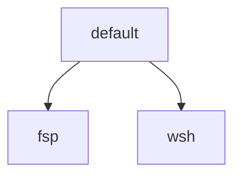

# Employer Profiles and Wave Removal Design

**Status:** Approved

**Date:** 2026-08-26

## Purpose

The bootstrap still has a single `work` profile that mixes a previous employer
(`fsp`) with the current one (`wsh`), and it still treats Wave Terminal as the
default terminal trial. Neither matches how this machine is used: coding-agent
GUIs and their built-in terminals are the daily shell, Wave was never the
intended trial (Warp was), and Warp is not in use yet.

This change splits employer desired state into two named leaves, removes Wave
from live desired state, and makes GitLab CLI opt-in instead of baseline.

## Goals

- Replace `--profile work` with `--profile fsp` and `--profile wsh`.
- Keep `default` as the portable personal baseline.
- Remove Wave as a managed application, config file, skip key, and doctor
  check.
- Leave a later Warp add as a new skippable cask plus config file, using the
  same pattern the coding agents already use. Do not add Warp now.
- Move previous-job runtime onto `fsp` and current-job env onto `wsh`.
- Make `glab` an opt-in include, available on any profile.
- Update live contracts (README, `docs/manual-steps.md`, `tests/test_docs.py`)
  so they describe the new profiles and software choices.

## Non-goals

- Adding Warp, iTerm, or any other dedicated terminal to desired state.
- Uninstalling a Wave.app that is already on disk.
- Installing a gcloud formula or managing `~/.config/gcloud`.
- Rewriting historical specs and plans under `docs/superpowers/`.
- Data-driven doctor/plan hooks that avoid naming `fsp` in Python.
- Keeping `work` as an alias or parent profile.
- Gating shared skills on include keys.
- Moving genericized skills (`using-jujutsu`, review skills, `using-gitlab`,
  `writing-executive-communications`, and the rest) off `default`.
- Changing Plato or Avogadro source repositories.
- Removing the tracked-tree guard against `import plato`, `Projects/plato`, and
  `plato:skill`. That guard is portability policy, not an install leftover.

## Approaches considered

**Minimal retarget.** Recommended and selected. Replace the `work` leaf with
`fsp` and `wsh`. Move each `"work"` special case to the employer that owns it.
Delete Wave from live manifests, config, docs, and tests. Keep one extra shell
file at `~/.zprofile.work` so switching `--profile` replaces content.

**Data-driven employer hooks.** Rejected for this change. Doctor, plan, and
overlays would be declared on components instead of branching on profile names.
Better if a third employer appears soon; more code than this cleanup needs.

**Keep a `work` alias.** Rejected. A synonym or parent named `work` preserves
the special-casing problem this change exists to leave.

**Keep Wave as a Warp template.** Rejected. Wave settings are Wave-specific
JSON and paths. The reusable pattern is already skippable cask plus managed
config, demonstrated by Cursor, Claude Code, and Codex. Git history is enough
if Warp is added later.

**Put `glab` on `fsp` only.** Rejected. GitLab is a forge, not an employer
bundle. An include matches Obsidian, Signal, and MacTeX.

## Architecture

The CLI still takes one `--profile` leaf. Resolution still expands that leaf
and its ancestors. There is no `work` alias: `--profile work` is an unknown
profile.



`default` is the portable baseline. `fsp` and `wsh` each extend `default` only.
Delete `manifests/profiles/work.yaml`. Daily current-job command is
`./bootstrap --profile wsh`. Previous-job command is `./bootstrap --profile fsp`.

Wave leaves live desired state: no cask, no `terminal/wave/` settings, no
`--skip wave`. A Wave.app already on disk is unmanaged, same as iTerm. Warp is
not added.

Historical documents under `docs/superpowers/` stay as history. Live contracts
are README, `docs/manual-steps.md`, manifests, code, and tests.

## Inventory

### `default`

Portable baseline: Homebrew CLI tools except `glab`, coding agents, shell,
Git, Jujutsu, SSH, Brave, Meslo. No Wave. No employer packages. Does not
install `~/.zprofile.work`.

### `wsh`

Extends `default`. Adds only current-job extra env: gcloud application default
credentials path for GDAL/`gs://` use, written to `~/.zprofile.work`. No gcloud
formula. No AWS, Bedrock, Atlassian, or `libmagic`.

### `fsp`

Extends `default`. Adds previous-job runtime:

- `awscli`
- `libmagic` (the `python-magic` prerequisite formerly justified as Plato /
  Avogadro support)
- Cursor Bedrock settings overlay
- Atlassian MCP exact-document copy
- aws-auth plan and doctor checks
- a comment-only `~/.zprofile.work` stub so a prior `wsh` run cannot keep
  injecting ADC

Live README and manual-steps wording that currently says “work profile /
Plato / Avogadro” retargets to `fsp` without those product names.

### Includes

Existing opt-ins stay: Obsidian, Signal, MacTeX. `glab` remains a
`brew_formula` in `manifests/packages.yaml` (not an application cask). Give it
`profiles: [default]`, `enabled_by_default: false`, `include_key: glab`, and
`required: false`, matching those apps' selection fields. Any profile can pass
`--include glab`. Example for previous-job GitLab remotes:

```bash
./bootstrap --profile fsp --include glab
```

`using-gitlab` stays a `default` shared skill. It already tells agents to check
PATH rather than assume the CLI is installed. `gitlab.com` stays in the
portable SSH config as a public host.

Genericized skills stay on `default` even when Plato was the provenance. Catalog
provenance lines that cite Plato remain audit metadata.

## Configuration and overlays

### Extra shell env

Default `~/.zprofile` keeps sourcing `~/.zprofile.work` when that file exists.
Do not rename the destination to `.zprofile.employer`. The path means
job-specific extra env, not the retired `work` profile.

Repository sources are `dotfiles/shell/zprofile.wsh` (ADC export) and
`dotfiles/shell/zprofile.fsp` (comment-only stub that passes `zsh -n`). Both
configuration specs share destination `.zprofile.work` and are tagged only
`profiles: [wsh]` and `profiles: [fsp]` respectively. They must not also list
`default`. Resolution includes ancestors, so a `default`-tagged spec would
match when `wsh` or `fsp` is selected and collide at the same destination.

Configure replaces the file when switching between `fsp` and `wsh`. Replace the
single `zprofile-work` spec and `dotfiles/shell/zprofile.work` with those two
profile-tagged specs. `default` does not install the extra file. Switching to
`--profile default` therefore leaves a previous `~/.zprofile.work` in place, and
default `~/.zprofile` still sources it if it is readable. That leftover is
accepted: daily use is an employer leaf, and the `fsp` stub covers
employer-to-employer switches.

### Cursor settings overlay versus Atlassian MCP

These are two `fsp` resources, not one:

1. **Settings overlay.** Rename `assistants/cursor/settings.work.json` to
   `assistants/cursor/settings.fsp.json`. Merge Bedrock into Cursor settings
   (`CLAUDE_CODE_USE_BEDROCK=1`, `AWS_REGION=us-east-1`) only when `fsp` is in
   the resolved profile set. `default` and `wsh` get base settings only.
   Retarget `cursor.settings.work` in `assistants/inventory.yaml` and the
   `"work" in profiles` branches in `src/ballen_config/assistants/cursor.py`.
2. **Atlassian MCP.** Keep `assistants/cursor/atlassian-workaround.json` as the
   exact secret-free document copied to `~/.cursor/mcp.json`. Bind
   `cursor.atlassian-mcp` and the managed-state exception in
   `src/ballen_config/assistants/models.py` to `profiles: [fsp]`. No new MCP
   servers.

### Wave

Remove the `wave` application component, the `wave-settings` configuration
spec, and `terminal/wave/settings.json`. Coding-agent skip keys are unchanged.
`--skip wave` becomes an unknown skip.

## Doctor, plan, and errors

Doctor and plan follow the resolved set, not the name `work`.

- AWS sign-in plan action and `aws sts get-caller-identity` run only when
  `fsp` is in the resolved profiles.
- `gitlab-auth` plan action and `glab auth status` run only when `glab` is in
  the resolved components. When they run, use the same ready / manual warning
  pattern as GitHub auth. Drop the GitLab-only INFO-on-failure special case;
  optional install is now expressed by not selecting `glab`.
- GitHub auth stays on the baseline.
- Wave has no application check.
- `--profile work` and `--skip wave` are unknown-selection errors.
- The Atlassian exact-document guard requires `profiles: [fsp]`.

## Live documentation

Update README sections that describe profiles, skip keys, and software
choices:

- Profiles are `default`, `fsp`, and `wsh`. Example skip remains a coding
  agent, not Wave.
- Software choices no longer name Wave as the default terminal trial. State
  that no dedicated terminal is in desired state, iTerm remains an unmanaged
  fallback, and Warp can be added later as a skippable cask.
- `libmagic` belongs to `fsp`.
- `glab` is an include, not baseline.
- Atlassian MCP remains the narrow Cursor exception, now on `fsp`.

Update `docs/manual-steps.md`: doctor against the selected employer profile;
GitLab login only if `glab` is included; AWS sign-in only for `fsp`.

`tests/test_docs.py` must match those live sentences. Do not rewrite
historical `docs/superpowers/` specs or plans.

## Python and test retargets

Replace hardcoded `"work"` profile checks with `fsp` or `wsh` as this design
assigns them. Known sites:

- `src/ballen_config/doctor.py`
- `src/ballen_config/planning.py`
- `src/ballen_config/assistants/cursor.py`
- `src/ballen_config/assistants/models.py`
- `src/ballen_config/assistants/checks.py`

Tests that used `--profile work` as “full employer setup” split: `fsp` for
AWS / Bedrock / Atlassian / `libmagic`, `wsh` for ADC env. Public interface
lines gain `profile fsp`, `profile wsh`, and `include glab`, and lose
`profile work` and `skip wave`.

Cover at least:

- `fsp` versus `wsh` versus `default` component sets
- overlay and Atlassian only on `fsp`
- `~/.zprofile.work` content by employer profile
- `gitlab-auth` absent unless `--include glab`
- aws-auth absent on `wsh` and `default`
- Wave absent from manifests, interface, and live docs
- unknown `work` profile and unknown `wave` skip

## Out of scope leftovers

Repo-root self-review markdown and old implementation plans that mention Plato
are history, not live desired state. Leave them.

A later Warp component, if wanted, is a new cask, settings file, `skip_key`,
and doctor path. This design does not sketch Warp’s native config schema.
