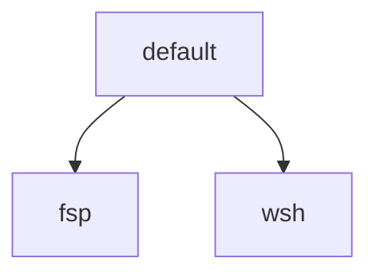

# Employer Profiles and Wave Removal Design

**Status:** Approved

**Date:** 2026-08-26

## Purpose

The bootstrap still has a single `work` profile that mixes a previous employer
(`fsp`) with the current one (`wsh`), and it still treats Wave Terminal as the
default terminal trial. Neither matches how this machine is used: coding-agent
GUIs and their built-in terminals are the daily shell, Wave was never the
intended trial, and no dedicated terminal is in use yet.

This change splits employer desired state into two named leaves, removes Wave
from live desired state, makes GitLab CLI opt-in, and removes owned managed
files that left the current plan so profile extras cannot leak.

## Goals

- Replace `--profile work` with `--profile fsp` and `--profile wsh`.
- Keep `default` as the portable personal baseline.
- Remove Wave as a managed application, config file, skip key, and doctor
  check.
- Move previous-job runtime onto `fsp` and current-job env onto `wsh`.
- Make `glab` an opt-in include, available on any profile.
- After configure applies the current spec set, prune owned managed files
  whose records are no longer in that set.
- Update live contracts (README, `docs/manual-steps.md`, `tests/test_docs.py`)
  so they describe the new profiles and software choices.

## Non-goals

- Adding Warp, iTerm, or any other dedicated terminal to desired state.
- Uninstalling a Wave.app that is already on disk.
- Installing a gcloud formula or managing `~/.config/gcloud`.
- Rewriting historical specs and plans under `docs/superpowers/`.
- Data-driven doctor/plan hooks that avoid naming `fsp` in Python.
- Keeping `work` as an alias or parent profile.
- Gating shared skills on include keys.
- Moving genericized skills off `default`.
- Changing Plato or Avogadro source repositories.
- Removing the tracked-tree guard against `import plato`, `Projects/plato`, and
  `plato:skill`.
- An `ensure-absent` manifest field, destination override rules, or an
  active-profile marker.
- Renaming `dotfiles/shell/zprofile.work` or `assistants/cursor/settings.work.json`.

## Approaches considered

**Minimal retarget plus prune.** Selected. Replace the `work` leaf with `fsp`
and `wsh`. Move each `"work"` special case to the employer that owns it.
Delete Wave from live manifests, config, docs, and tests. Keep existing extra
file paths. Close leftover extras by pruning owned managed files that left the
plan.

**Comment-only `fsp` stub and split zprofile sources.** Rejected. Duplicate
destinations already fail closed, a `default`-tagged stub would also match
`wsh`, and a stub would not remove `~/.cursor/mcp.json`.

**Most-specific destination override.** Rejected. New configure exception for
one file, still misses Atlassian MCP.

**Active-profile marker and conditional `source`.** Rejected. New concept, ADC
file lingers, MCP still leaks.

**Data-driven employer hooks.** Rejected. More code than this cleanup needs.

**Keep a `work` alias or Wave as a Warp template.** Rejected.

**Put `glab` on `fsp` only.** Rejected. GitLab is a forge; an include matches
Obsidian, Signal, and MacTeX.

## Architecture

The CLI still takes one `--profile` leaf. Resolution still expands that leaf
and its ancestors. There is no `work` alias: `--profile work` is an unknown
profile.

`default` is the portable baseline. `fsp` and `wsh` each extend `default` only.
Delete `manifests/profiles/work.yaml`. Daily current-job command is
`./bootstrap --profile wsh`. Previous-job command is `./bootstrap --profile fsp`.

Wave leaves live desired state: no cask, no `terminal/wave/` settings, no
`--skip wave`. A Wave.app already on disk is unmanaged, same as iTerm.

Historical documents under `docs/superpowers/` stay as history. Live contracts
are README, `docs/manual-steps.md`, manifests, code, and tests.

## Inventory

### `default`

Portable baseline: Homebrew CLI tools except `glab`, coding agents, shell,
Git, Jujutsu, SSH, Brave, Meslo. No Wave. No employer packages.

### `wsh`

Extends `default`. Adds only current-job extra env: keep
`dotfiles/shell/zprofile.work` (gcloud ADC for GDAL/`gs://`) and retag the
existing `zprofile-work` spec to `profiles: [wsh]`. No gcloud formula. No AWS,
Bedrock, Atlassian, or `libmagic`.

### `fsp`

Extends `default`. Adds previous-job runtime:

- `awscli`
- `libmagic`
- Cursor Bedrock overlay from existing `assistants/cursor/settings.work.json`
- Atlassian MCP exact-document copy
- aws-auth plan and doctor checks

Live README and manual-steps wording that currently says “work profile /
Plato / Avogadro” retargets to `fsp` without those product names.

### Includes

Existing opt-ins stay: Obsidian, Signal, MacTeX. `glab` remains a
`brew_formula` in `manifests/packages.yaml`. Give it `profiles: [default]`,
`enabled_by_default: false`, `include_key: glab`, and `required: false`. Any
profile can pass `--include glab`.

`using-gitlab` stays a `default` shared skill. `gitlab.com` stays in the
portable SSH config. Catalog provenance lines that cite Plato remain audit
metadata.

## Configuration and overlays

### Extra shell env

Default `~/.zprofile` keeps sourcing `~/.zprofile.work` when that file exists.
Do not rename the destination. Tag the existing spec `profiles: [wsh]` only.
Do not add an `fsp` stub. Prune removes the file when `wsh` is not selected
and ownership still holds.

### Cursor settings overlay versus Atlassian MCP

These are two `fsp` resources, not one. Keep current paths and resource ids.

1. **Settings overlay.** Keep `assistants/cursor/settings.work.json` and
   `cursor.settings.work`. Apply the Bedrock merge only when `fsp` is in the
   resolved profile set. Retarget the `"work" in profiles` branches in
   `src/ballen_config/assistants/cursor.py` to `fsp`. `default` and `wsh` get
   base settings only (same `settings.json` destination, so the renderer
   replaces overlay bits; no prune needed for that file).
2. **Atlassian MCP.** Keep `assistants/cursor/atlassian-workaround.json` copied
   to `~/.cursor/mcp.json`. Bind `cursor.atlassian-mcp` and the managed-state
   exception to `profiles: [fsp]`. Prune removes that destination when `fsp` is
   not selected and ownership still holds. No new MCP servers.

### Wave

Remove the `wave` application component, the `wave-settings` configuration
spec, and `terminal/wave/settings.json`. If a previous run still owns
`~/.config/waveterm/settings.json` in state, prune removes that file. It does
not uninstall Wave.app. `--skip wave` becomes an unknown skip.

### Prune owned files that left the plan

Configure already records ownership in `StateStore` (`ManagedRecord` with
source and destination digests) and uses `compare_and_remove` for skill-rename
cleanup. Complete that loop for ordinary managed files.

Under the same mutation lock, after applying the current spec set:

1. Load state. For each `managed` record whose `resource_id` is not in the
   current spec ids, consider it stale.
2. If the destination is missing, drop the record only.
3. If the destination exists and its digest still equals
   `destination_digest`, backup, unlink, then `compare_and_remove` the record.
   Fail closed if the record changed under the lock, same as skill-renames.
4. If the digest does not match, leave the file and the record. Do not fail
   the run. A later `wsh`/`fsp` apply can still update because ownership
   remains.

Plan must list these removals before mutation (`outcome: "removed"`). Duplicate
destinations among current specs stay a hard error. No new manifest field.

This closes leftover `~/.zprofile.work` on `default` and `fsp`, leftover
Atlassian MCP on `default` and `wsh`, and leftover Wave settings after the
spec is deleted.

## Doctor, plan, and errors

Doctor and plan follow the resolved set, not the name `work`.

- AWS sign-in plan action and `aws sts get-caller-identity` run only when
  `fsp` is in the resolved profiles.
- `gitlab-auth` plan action and `glab auth status` run only when `glab` is in
  the resolved components. When they run, use the same ready / manual warning
  pattern as GitHub auth. Drop the GitLab-only INFO-on-failure special case.
- GitHub auth stays on the baseline.
- Wave has no application check.
- `--profile work` and `--skip wave` are unknown-selection errors.
- The Atlassian exact-document guard requires `profiles: [fsp]`.

## Live documentation

Update README: profiles `default` / `fsp` / `wsh`; example skip is a coding
agent; no dedicated terminal in desired state; iTerm remains an unmanaged
fallback; `libmagic` on `fsp`; `glab` is an include; Atlassian MCP on `fsp`.

Update `docs/manual-steps.md`: doctor against the selected employer profile;
GitLab login only if `glab` is included; AWS sign-in only for `fsp`.

`tests/test_docs.py` must match those live sentences. Do not rewrite
historical `docs/superpowers/` specs or plans.

## Python and test retargets

Replace hardcoded `"work"` profile checks with `fsp` or `wsh` as this design
assigns them. Known sites:

- `src/ballen_config/doctor.py`
- `src/ballen_config/planning.py`
- `src/ballen_config/assistants/cursor.py`
- `src/ballen_config/assistants/models.py`
- `src/ballen_config/assistants/checks.py`
- `src/ballen_config/configure.py` (prune plus `removed` outcome)

Tests that used `--profile work` as “full employer setup” split: `fsp` for
AWS / Bedrock / Atlassian / `libmagic`, `wsh` for ADC env. Public interface
lines gain `profile fsp`, `profile wsh`, and `include glab`, and lose
`profile work` and `skip wave`.

Cover at least:

- `fsp` versus `wsh` versus `default` component sets
- overlay and Atlassian only on `fsp`
- `zprofile-work` only on `wsh`
- prune of owned `~/.zprofile.work` when `wsh` is not selected
- prune of owned Atlassian MCP when `fsp` is not selected
- prune skipped when destination digest no longer matches
- `gitlab-auth` absent unless `--include glab`
- aws-auth absent on `wsh` and `default`
- Wave absent from manifests, interface, and live docs

## Out of scope leftovers

Repo-root self-review markdown and old implementation plans that mention Plato
are history, not live desired state. Leave them.
